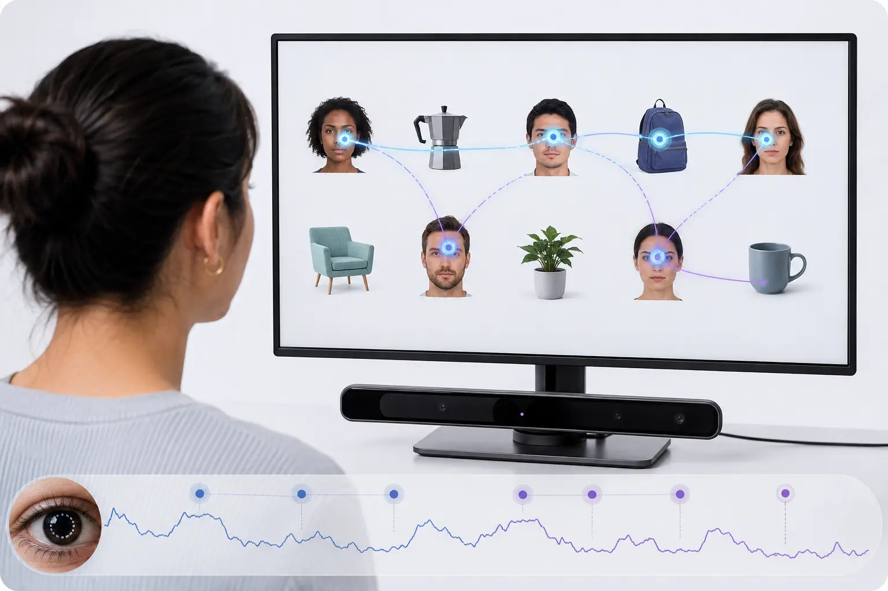
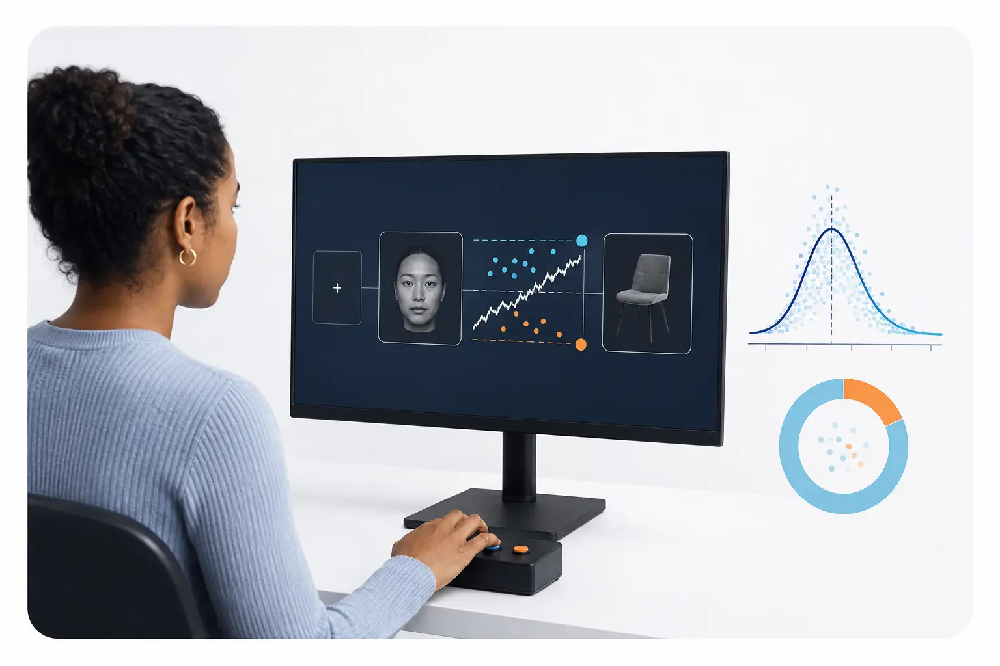

## Our goal

The central question of the Multimodal Cognitive Neuroscience Lab is how the human brain transforms visual information into meaningful representations that support higher-order social cognition, memory, and learning. We study these transformations in neurotypical individuals and in individuals with schizophrenia or autism.

## Complementary modalities

Each method captures a different aspect of the transformation from visual input to meaningful cognition.

::: {.modality-grid}
::: {.modality-panel}
{.modality-image}

### Intracranial recordings + eye tracking

Research recordings in clinical patient rooms combine single-neuron activity, local field potentials, and iEEG with simultaneous gaze and pupil measurements during visual tasks.
:::

::: {.modality-panel}
{.modality-image}

### 7T functional MRI

Ultra-high-field fMRI maps fine-grained BOLD responses and distributed representations across the human brain.
:::

::: {.modality-panel}
{.modality-image}

### Eye tracking

Gaze position, fixation patterns, and pupil dynamics reveal how people sample visual information and allocate attention.
:::

::: {.modality-panel}
{.modality-image}

### Behavioral experiments

Controlled tasks quantify visual recognition, social judgments, memory, learning, accuracy, and decision time.
:::
:::

## Integration across modalities

::: {.integration-panel}
{.integration-image}

::: {.integration-copy}
We combine neural recordings, ultra-high-field imaging, eye tracking, behavior, and computational modeling to explain how visual features become identities, concepts, memories, learned representations, and social inferences.

**Populations:** neurotypical individuals · individuals with schizophrenia · individuals with autism
:::
:::

## Research themes

::: {.research-grid}
::: {.research-card}
### From visual features to meaning

How does the brain transform eyes, mouths, shapes, and other visual features into stable representations of people, objects, identities, and concepts? We study this transformation across visual, temporal, and medial temporal systems.
:::

::: {.research-card}
### Memory and learning

We investigate how visual experience builds and updates meaningful representations, how those representations support memory, and how learning changes neural codes over time.
:::

::: {.research-card}
### Higher-order social cognition

Faces and gestures let us infer the traits, emotions, thoughts, and intentions of other people. We investigate the neural population codes and computations that support these rapid social evaluations.
:::

::: {.research-card}
### Individual and clinical variation

We compare neurotypical individuals with individuals with schizophrenia or autism to understand both shared mechanisms and meaningful variation in visual and social cognition.
:::

::: {.research-card}
### Multimodal integration

Single-neuron recordings, iEEG, fMRI, eye tracking, and behavior reveal different aspects of the same system. We develop quantitative approaches that align these scales into coherent mechanistic accounts.
:::

::: {.research-card}
### Reproducible and AI-assisted science

We develop transparent workflows for complex neuroscience data and investigate carefully evaluated uses of agentic AI in data processing, model development, and scientific reasoning.
:::
:::

## Methods

- Human single-neuron recordings
- Intracranial EEG and temporally resolved neural measurements
- Functional MRI, including opportunities for high-field 7T imaging
- Eye tracking and quantitative behavioral experiments
- Computational modeling, machine learning, and deep neural networks
- Multimodal data integration
- Reproducible data processing and agent-assisted research workflows

## Collaborative environment

Our home in the [Neuroimaging Labs Research Center](https://www.mir.wustl.edu/research/research-centers/neuroimaging-labs-research-center-nil-rc/) provides a highly collaborative environment spanning human cognitive and clinical neuroscience, systems neuroscience, neurodevelopment, advanced imaging, and quantitative analysis. We welcome collaborations that bring together complementary scientific questions, datasets, and methods.
