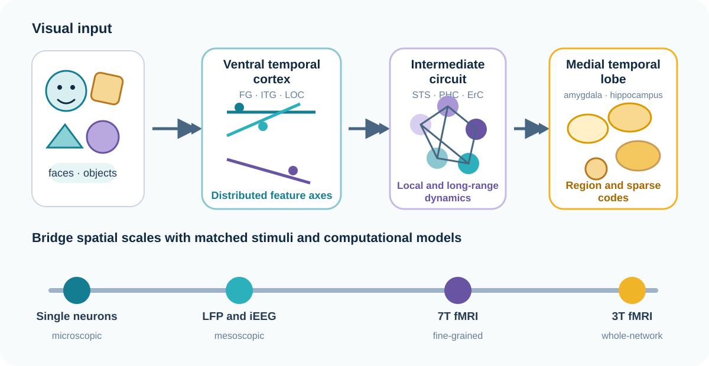
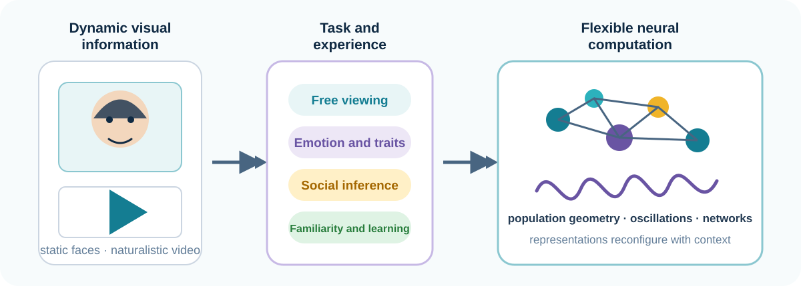
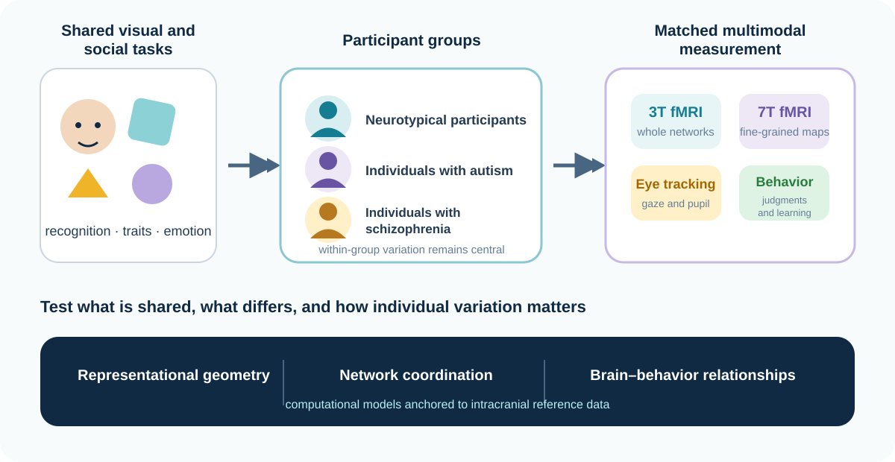
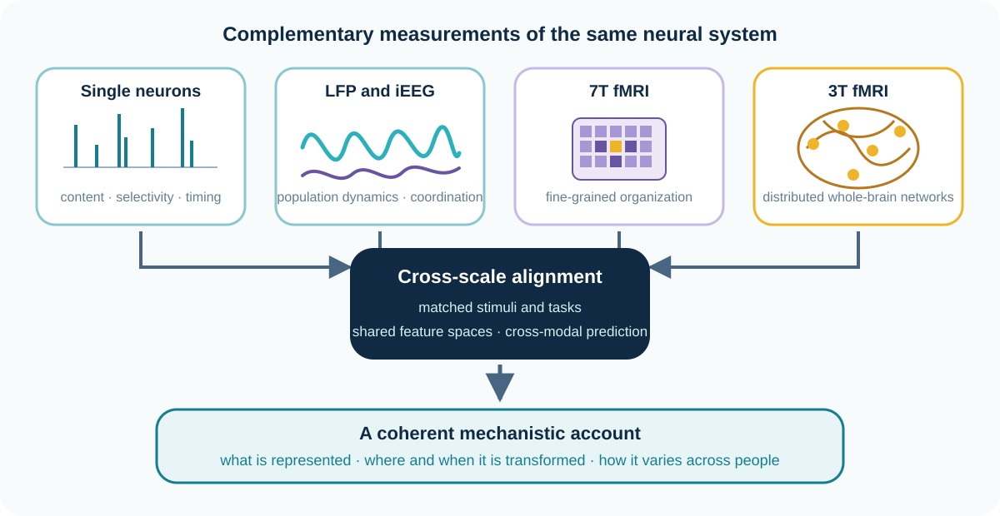
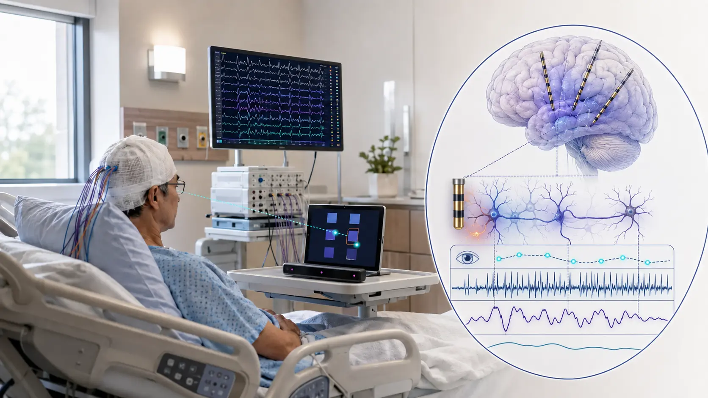
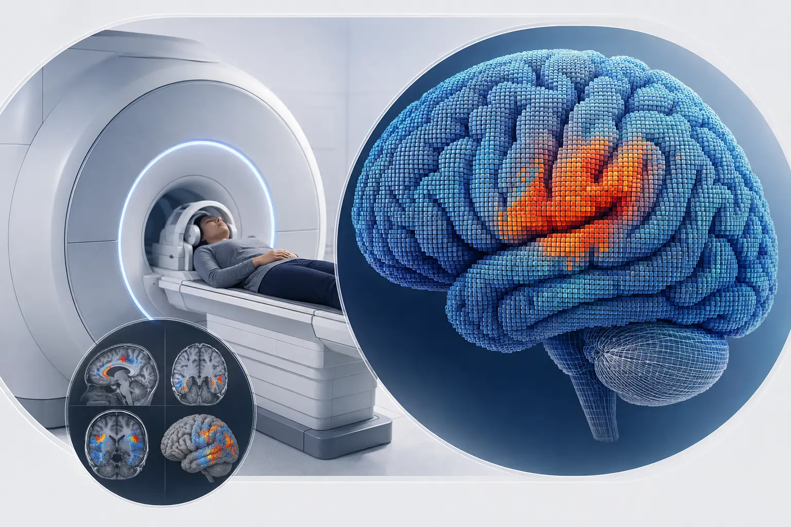

## Our goal

The central question of the Multimodal Cognitive Neuroscience Lab is how people use visual information to navigate the complex social world. Specifically, we aim to understand the neural computations and network-level dynamics that transform detailed visual representations of faces and objects into meaningful representations of identity, social evaluation, and memory. We are also interested in examining how these processes are altered in individuals with neuropsychiatric conditions, including schizophrenia and autism.

## Research themes

Our research program connects four themes: how visual representations are constructed, how they adapt to task and experience, how they differ in neuropsychiatric disorders, and how measurements across neural scales can be integrated into a common mechanistic account.

::: {.research-grid}
::: {.research-card}
### Face and object perception

{.theme-figure}

How does the brain transform detailed visual information into abstract representations of identities, concepts, and social attributes? We study this transformation across a distributed network spanning ventral temporal, medial temporal, and prefrontal regions by mapping the distribution of coding schemes and testing how interareal interactions transform visual features into stable, behaviorally meaningful representations.

#### Current questions

- How do distributed feature codes in the ventral temporal cortex become increasingly selective and sparse representations in higher-order brain areas, such as the medial temporal and prefrontal cortices?
- Which coding principles generalize across faces, objects, semantic knowledge, and memorability?
- How do local dynamics and long-range interactions support the transformation from visual features to meaning?

#### Relevant publications

- [Computational single-neuron mechanisms of visual object coding in the human temporal lobe](https://doi.org/10.1038/s41467-026-68954-8). *Nature Communications* (2026).
- [A neural computational framework for face processing in the human temporal lobe](https://doi.org/10.1016/j.cub.2025.02.063). *Current Biology* (2025).
- [Feature-based encoding of face identity by single neurons in the human amygdala and hippocampus](https://doi.org/10.1038/s41562-025-02218-1). *Nature Human Behaviour* (2025).
- [A neuronal code for object representation and memory in the human amygdala and hippocampus](https://doi.org/10.1038/s41467-025-56793-y). *Nature Communications* (2025).
:::

::: {.research-card}
### Social inference

{.theme-figure}

Beyond recognizing identities, people rapidly infer others’ emotional states and form first impressions from faces. These inferences are context-dependent and influenced by task demands and prior experience. We study how the underlying neural computations and functional connectivity change across free viewing, emotion recognition, social-trait judgment, and memory tasks, and how face representations evolve dynamically during naturalistic viewing.

#### Current questions

- How do tasks and contexts reshape the visual and social information encoded by neural populations?
- How do face representations emerge and update as socially meaningful events unfold during naturalistic viewing?
- How do familiarity and learning alter representational geometry and communication among temporal-lobe regions?

#### Relevant publications

- [Domain-specific representation of social inference by neurons in the human amygdala and hippocampus](https://doi.org/10.1126/sciadv.ado6166). *Science Advances* (2024).
- [Neural mechanisms of face familiarity and learning in the human amygdala and hippocampus](https://doi.org/10.1016/j.celrep.2023.113520). *Cell Reports* (2024).
- [A neuronal social trait space for first impressions in the human amygdala and hippocampus](https://doi.org/10.1038/s41380-022-01583-x). *Molecular Psychiatry* (2022).
- [Task modulation of single-neuron activity in the human amygdala and hippocampus](https://doi.org/10.1523/ENEURO.0398-21.2021). *eNeuro* (2021).
:::

::: {.research-card}
### Neuropsychiatric disorders

{.theme-figure}

Social deficits are hallmark features of various neurodevelopmental and psychiatric disorders, including autism and schizophrenia, both of which have been broadly associated with atypical face processing. However, the neural computational mechanisms underlying these impairments remain largely unclear. We aim to test how computational frameworks of face and object processing established in neurotypical populations are altered in these clinical conditions and how these changes are associated with social dysfunction. Building on our work in autism, we are extending these frameworks to schizophrenia.

#### Current questions

- Which components of visual and social computation are shared across populations, and which are altered in autism or schizophrenia?
- How do differences in gaze, representational geometry, and network organization relate to social behavior?
- Can computational measures explain meaningful individual variation beyond group-average differences?

#### Relevant publications

- [Comprehensive social trait judgments from faces in autism spectrum disorder](https://doi.org/10.1177/09567976231192236). *Psychological Science* (2023).
- [Atypical neural encoding of faces in individuals with autism spectrum disorder](https://doi.org/10.1093/cercor/bhae060). *Cerebral Cortex* (2024).
- [Differences in the link between social trait judgment and socio-emotional experience in neurotypical and autistic individuals](https://doi.org/10.1038/s41598-024-56005-5). *Scientific Reports* (2024).
- [Distinct neurocognitive bases for social trait judgments of faces in autism spectrum disorder](https://doi.org/10.1038/s41398-022-01870-9). *Translational Psychiatry* (2022).
:::

::: {.research-card}
### Multimodal integration

{.theme-figure}

Single-neuron recordings, iEEG, and fMRI reveal different aspects of the same neural system across space and time. Each modality provides a powerful but incomplete view. Single-neuron recordings reveal the content and selectivity of individual responses with millisecond precision. Local field potentials and iEEG capture population dynamics and coordination across regions. Ultra-high-field 7T fMRI resolves fine spatial organization in targeted circuits, while 3T fMRI maps distributed systems in larger neurotypical and clinical cohorts. Eye tracking and behavior constrain what information enters the system and how neural computations relate to cognition. We are developing quantitative approaches that align these scales into coherent mechanistic accounts of how visual information becomes meaningful—from the selectivity of individual neurons, through the timing and coordination of neural populations, to the fine-grained and whole-brain organization measured with fMRI. Analyzing these measurements in isolation makes it difficult to determine whether a neuronal code, an electrophysiological pattern, and a BOLD representation reflect the same underlying computation. Establishing that correspondence allows us to connect cellular coding to network dynamics and behavior, identify where information is transformed rather than merely represented, and distinguish mechanisms that generalize across people from those that vary with task, experience, autism, or schizophrenia.

#### Current questions

- Can a shared computational space align single-neuron selectivity, electrophysiological dynamics, and multivoxel BOLD representations?
- Which transformations are expressed in neuronal activity, temporal interactions, fine-scale 7T organization, and distributed 3T networks?
- Which cross-scale relationships generalize across stimuli, tasks, individuals, and clinical populations?

:::
:::

[View the complete publication record](publications.qmd){.btn .btn-primary}

## Complementary modalities

We use a multimodal neuroscience platform capable of capturing neural signals across spatial and temporal scales—from single-neuron activity and local field potentials to iEEG, fine-grained 7T fMRI, and distributed whole-brain networks measured with 3T fMRI. We combine these neural signals with computational modeling, eye tracking, and behavioral measures to delineate the multiscale neurocomputational and circuit mechanisms underlying human cognition.

::: {.modality-grid}
::: {.modality-panel}
{.modality-image}

### Intracranial recordings + eye tracking

Research recordings in clinical patient rooms combine single-neuron activity, local field potentials, and iEEG with simultaneous eye tracking and behavioral measurements during visual tasks.
:::

::: {.modality-panel}
{.modality-image}

### 3T and 7T functional MRI

3T fMRI characterizes distributed representations and whole-brain networks across larger neurotypical and clinical cohorts. Ultra-high-field 7T fMRI provides finer spatial resolution for examining representational organization in targeted cortical and subcortical regions. Both are combined with behavioral tasks and, when appropriate, eye tracking.
:::
:::

## From converging measurements to mechanism

::: {.integration-panel}
{.integration-image}

::: {.integration-copy}
We combine single-neuron and iEEG recordings, 3T and 7T fMRI, eye tracking, behavioral measures, and computational modeling to explain how visual features are transformed into representations of identities, objects, and concepts that support memory, learning, and social inference.

**Populations:** neurotypical individuals · individuals with schizophrenia · individuals with autism
:::
:::

## Collaborative environment

Our home in the [Neuroimaging Labs Research Center](https://www.mir.wustl.edu/research/research-centers/neuroimaging-labs-research-center-nil-rc/) provides a highly collaborative environment spanning human cognitive and clinical neuroscience, systems neuroscience, neurodevelopment, advanced imaging, and quantitative analysis. We welcome collaborations that bring together complementary scientific questions, datasets, and methods.
